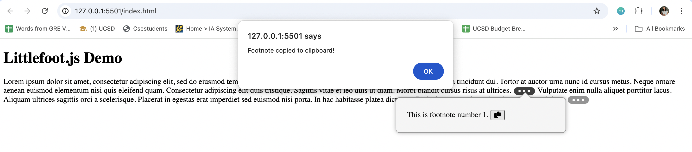
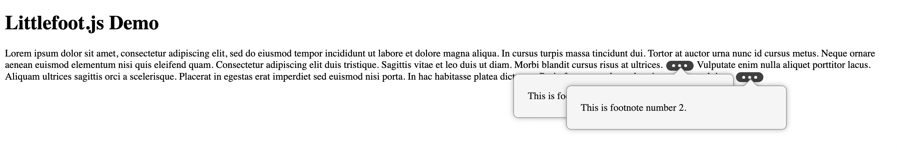
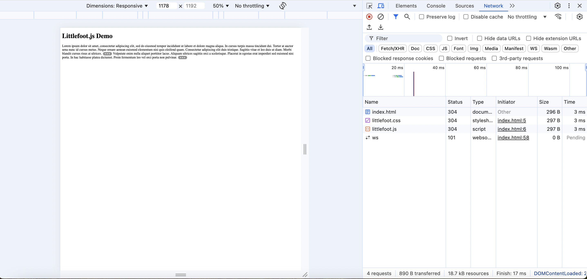
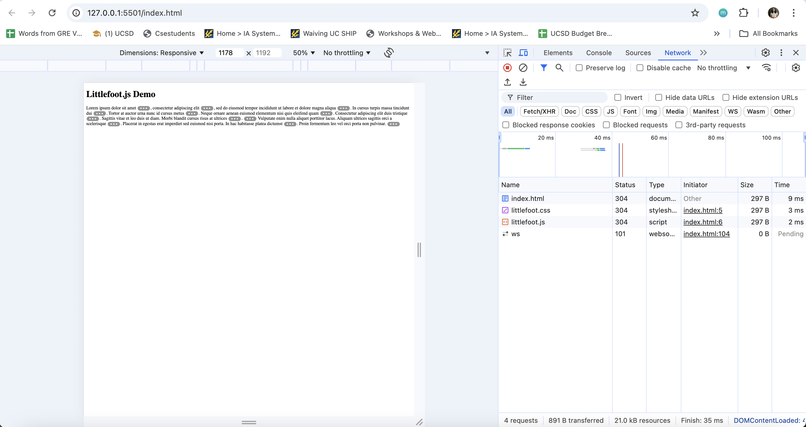
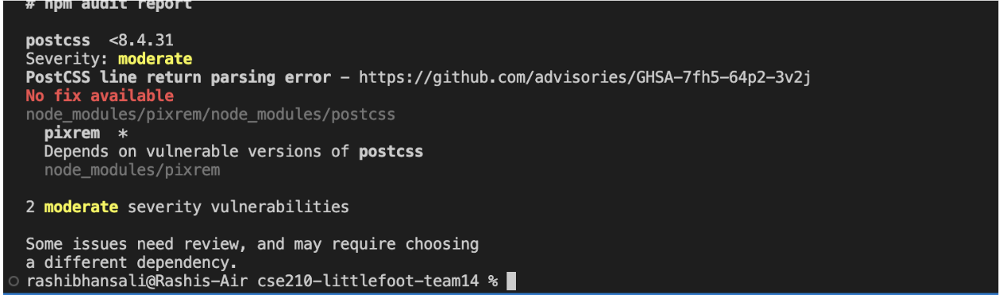

# Littlefoot Analysis

**Change:**  
*Added a clipboard icon to the footnote popover to copy its contents*

* Copied text     
    This is footnote number 1. 
    ↩

**Tool Pain Points:**

1. Multiple footnotes overlap.

2. Cannot be easily extended to React, Angular or other popular frameworks. Custom wrappers will have to be written.
3. As the no. of footnotes increases, handling multiple footnotes can affect the performance because there’s no inherent support for lazy loading, i.e. all footnotes will be initialized at once so the rendering becomes slow.
* With 2 footnotes: 
* With 10 footnotes: 
4. For adding custom interactions (like animation, redirection for embedded links, or even copying the data) when the footnote popover is loaded, there are no event hooks or APIs and it’s difficult to add custom scripts.
5. Uses pixrem - a vulnerable PostCSS module 
The vulnerability stems from an insecure use of regular expressions in the PostCSS library, which can allow malicious CSS rules to execute despite being formatted as comments.

6. Manual css needs to be written and there’s no theme support. The footnote content may lack control over how it is displayed. For example, displaying complex content or different footnote structures without modifying the default behavior is not trivial.
7. It doesn’t bind to dynamically loaded content. You need to manually reinitialize, so its usage in SPAs is limited.
8. Littlefoot addresses accessibility which Bigfoot missed, but it’s basic and needs additional effort to ensure it works well with screen readers and offers a comprehensive keyboard navigation.
---

## Code Review

### Architecture - Design Decisions:
- **Lightweight Approach:**  
  Littlefoot.js focuses on minimal impact on page load times.
- **Modularity:**  
  Designed for easy integration without altering the DOM structure.
- **Accessibility:**  
  Utilizes ARIA roles to improve screen reader compatibility.

### Code Organization:
- **File Structure:**  
  - Core functionality, utilities, and plugins are organized in separate files.  
  - Clear separation of concerns with distinct modules handling specific tasks.

- **Modular Pattern:**  
  Utilizes the Revealing Module Pattern to encapsulate functionality and expose only necessary components.

### Coding Practices
- **JavaScript Standards:**  
  The code adheres to ES6 standards, utilizing `let`, `const`, arrow functions, and template literals for cleaner syntax.
  
- **Code Comments:**  
  The codebase is well-commented, with descriptive comments explaining the functionality of complex sections.

- **Testing:**  
  There are unit tests included, ensuring that core functionalities are verified before release.

- **Clean Coding practices:**  
  The code is structured logically, with functions organized by their purpose. Naming conventions are consistent, making it easy to understand the role of each function and variable.

- **Language Use:**  
  The library effectively uses JavaScript’s features to promote readability and maintainability. The use of ES6 features enhances both performance and development speed.

### Repo Organization
- **Directory Structure:**  
  The repository has a clear and well-organized structure, with directories for `src`, `dist`, `tests`, and `docs`.

- **Documentation:**  
  The README file is thorough and readable, providing installation instructions, usage examples, and API documentation.

### Tool Quality
- **Pros:**  
  - Built using well-established tools such as Webpack for bundling and Babel for transpilation.
  - Continuous Integration (CI) tools are utilized to automate testing and ensure code quality with each update.
  - Compatible with modern browsers and offers a polyfill for older versions.

- **Cons:**  
  - Limited level of community engagement, with some contributions and issue discussions visible in the repository.
  - Loads everything at once, impacting performance as the number of footnotes grows.
  - Does not handle responsiveness well; viewing multiple footnotes at the same time does not address overlap and repositioning.

---

**Overall, _would I use Littlefoot.js?_**

Based on the review, I would consider using Littlefoot.js in my projects due to its thoughtful design, modular architecture, and focus on accessibility. It’s lightweight and much better than Bigfoot regarding customization, code readability, and overall look and feel. However, several challenges, as discussed above, can affect its usage.

### Reasons Against Usage

1. **Limited Feature Scaling:**  
   Littlefoot.js may not offer sufficient customization or scaling options for specific project requirements.  
   *Mitigation:* Implement a wrapper or extend the library to add custom functionalities.  
   *Effort:* Medium, as it would require a working knowledge of the library's internals.

2. **Possible Performance Issues:**  
   Depending on the project's size, there could be performance implications if footnote management becomes complex.  
   *Mitigation:* Lazy loading to optimize performance.  
   *Effort:* High, as it involves analyzing the current implementation and making performance enhancements.

3. **Documentation Gaps:**  
   Features, like the footnote being fixed at the bottom of the screen for a mobile-sized device, or why certain “decisions” have been made instead of providing “customization” options are not adequately documented.  
   *Mitigation:* Contribute to the documentation and create usage examples for complex features.  
   *Effort:* Low to Medium, depending on the extent of documentation needed.

---

**Conclusion**

Littlefoot.js is a well-structured and thoughtfully designed library for managing footnotes. While it has some limitations regarding customization and potential performance issues, the overall quality of the code, organization, and accessibility features make it a worthy consideration for projects requiring footnote management. Addressing the identified challenges could enhance its applicability in more complex scenarios and allow for a better user experience.
